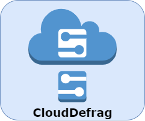

# CloudDefrag
***
Simulator for Resource Fragmentation and Defragmentation in the Cloud.

## Table of Contents
***
1. [Features](#features)
2. [Technologies](#technologies)
3. [Installation](#installation)
4. [Authors](#authors)
5. [License](#license)

### Features
***
- Cloud Defragmentation using live virtual resource migrations.
- Supports live migrations of Virtual Machines and Virtual Links.
- Computational Resources: CPU, Memory, Storage.
- Communication Resources: B.W, and Prop. Delay.
- Supports Containers hosting.

### Technologies
***
A list of technologies used within the project:
* [gurobipy](https://pypi.org/project/gurobipy/): Version 9.5.0 
  * Model the Defragmentation Mathematical Problem 
  * Optimization Solver
* [NetworkX](https://github.com/networkx/networkx): Version 2.6.3
  * Supports the creation, manipulation, and study of the structure,
  dynamics, and functions of complex networks.
  * Modeling the network infrastructure and requests.
* [SimPy](https://github.com/cristiklein/simpy): Version 4.0.1
  * Process-based discrete-event simulation framework.
  * Model the active components of the simulator: requests arrivals and
  departures.
* [Matplotlib ](https://github.com/matplotlib/matplotlib): Version 3.5.1
  * Visualization

### Authors
***
- [@RamyMo](https://www.github.com/RamyMo): [LinkedIn](https://www.linkedin.com/in/ramymfouad/) & [Contact Email](mailto:Ramy.Mohamed@carleton.ca)

### Contributing
***
Pull requests are welcome. For major changes, please open an issue first to discuss what you would like to change.

### License
***
[GNU GPLv3](https://choosealicense.com/licenses/gpl-3.0/)
